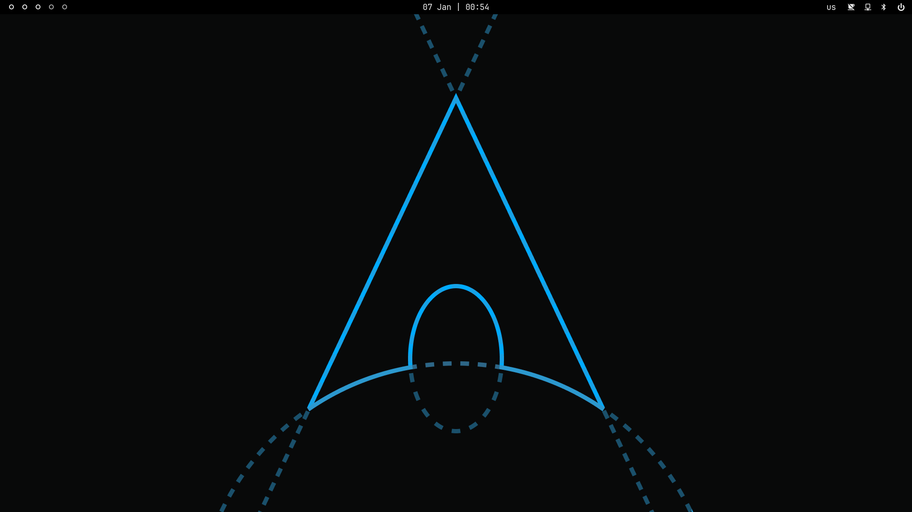
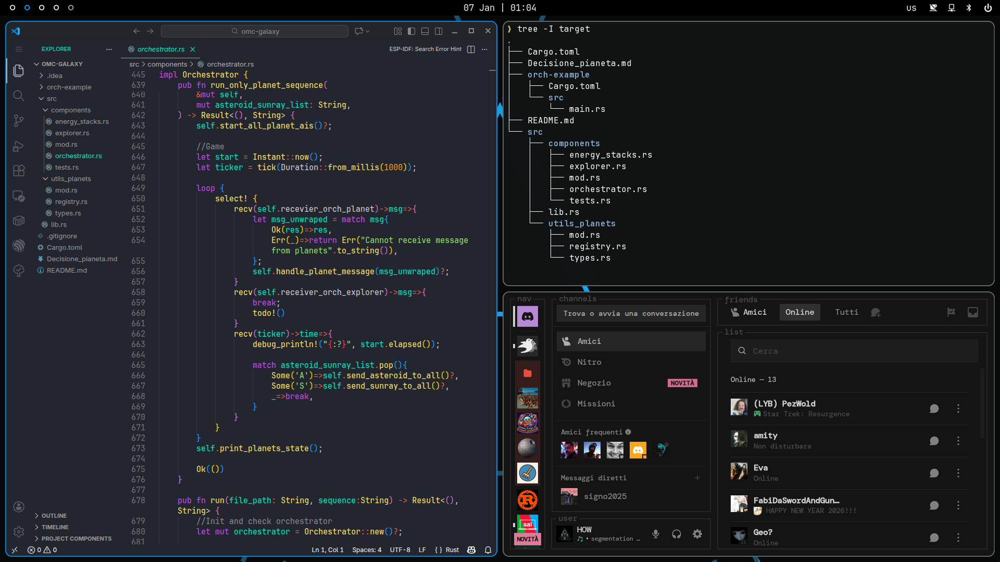

# Davide's Dotfiles ⚙️
_These are my personal dotfiles, based on Arch and SwayFX_




> [!WARNING]
> This repo is always changing!
> Breaking changes might be introduced at any moment.
> Use at your own risk!

## Installation
installation is handled via **GNU Stow**.
To install _user-level_ dotfiles run this in the repo root directory:
```bash
# desktop dotfiles
stow desktop

# laptop dotfiles (Microsoft Surface Pro 8)
stow laptop
```

To install _system-level_ dotfiles (***watch out!***):
```bash
sudo stow -t \ system
```

## Dependencies
### Desktop
| Service         | Program  |
|----------------:|:---------|
| Window Manager  | SwayFX   |
| Status Bar      | Waybar   |
| Terminal        | Ghostty  |
| Shell           | Zsh      |
| Prompt          | Starship |
| App menu        | Fuzzel   |
| Lock Menu       | Swaylock |
| Display Manager | Ly       |

### Laptop

| Service         | Program  |
|----------------:|:---------|
| Window Manager  | Hyprland |
| Background util | hyprpaper|
| Status Bar      | Waybar   |
| Terminal        | Ghostty  |
| Shell           | Zsh      |
| Prompt          | Starship |
| App menu        | Fuzzel   |
| Lock Menu       | Swaylock |
| Display Manager | Ly       |

### Other utilities

- **grim** + **slurp** for screenshots
- **wl-clipboard** to paste a screenshot into your clipboard 
- **polkit-gnome** for privilege auth 